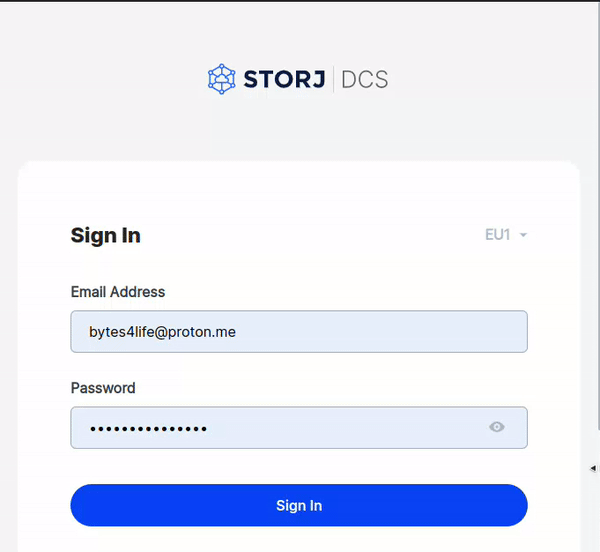

# Configurando un bucket público en Storj

## Creación de una cuenta en Storj

Empieza por crear una cuenta en [Storj](https://storj.io)

## Instala y configura `uplink`

`uplink` es la herramienta de linea de comando que nos permite acceder a todo el potencial de Storj.

Para poder usarlo tendrás que obtener un **access grant** en tu panel de Storj. Puedes guiarte mediantes esta animación:


Puedes [descargar e instalar `uplink` desde este enlace](https://docs.storj.io/dcs/getting-started/quickstart-uplink-cli/prerequisites)

## Añadimos las credenciales de acceso a `uplink`
```sh
./uplink access import acceso-storj 15M6fjpDJ...PD7y9xKx
./uplink access use acceso-storj
./uplink access list
```

## Creación del bucket

```sh
./uplink mb sj://proxecto
```

## Crear accesos
Es necesario conservar una copia de toda la información proporcionada pues no será posible obtenerla nuevamente. En caso de perder los datos obtenidos para el acceso necesitaremos dejar de compartir el bucket, repetir estos pasos y establecer los nuevos datos en la aplicación.
### Compartición privada de escritura permanente
```sh
./uplink share sj://proxecto/ --readonly=false --register
Sharing access to satellite 12L9ZFwhz...Y9G24tbiigLiXpmZWKwmcNDDs@eu1.storj.io:7777
=========== ACCESS RESTRICTIONS ==========================================================
Download  : Allowed
Upload    : Allowed
Lists     : Allowed
Deletes   : Allowed
NotBefore : No restriction
NotAfter  : No restriction
Paths     : sj://proxecto/ (entire bucket)
=========== SERIALIZED ACCESS WITH THE ABOVE RESTRICTIONS TO SHARE WITH OTHERS ===========
Access    : 19T3cUq1QiP6bazRTxQkv3QT3UjcNS3pa...D3834xEgeuLr1hMymwWknnyz
========== GATEWAY CREDENTIALS ===========================================================
Access Key ID: juoljevu...gxz3lzega
Secret Key   : j3o2yohq6c3dpddqremx...3zjvmpwxbbprtc2
Endpoint     : https://gateway.storjshare.io
Public Access: false
```
### Compartición pública de lectura permanente
```sh
./uplink share sj://proxecto/ --url --not-after=none 

Sharing access to satellite 12L9ZFwhzVpuEKMUNUqk...cNDDs@eu1.storj.io:7777
=========== ACCESS RESTRICTIONS ==========================================================
Download  : Allowed
Upload    : Disallowed
Lists     : Allowed
Deletes   : Disallowed
NotBefore : No restriction
NotAfter  : No restriction
Paths     : sj://proxecto/ (entire bucket)
=========== SERIALIZED ACCESS WITH THE ABOVE RESTRICTIONS TO SHARE WITH OTHERS ===========
Access    : 1xHgYxH19XJidS6J1YZRa...koDhDzkXnTTmLztZKwvqV9uQLGW1wVUksEPeKA
========== GATEWAY CREDENTIALS ===========================================================
Access Key ID: jv4oiecqto...wcvgdbfba
Secret Key   : jzd6qzfsouk7dcipum...5rjekeur4rcwbjdc7y
Endpoint     : https://gateway.storjshare.io
Public Access: true
=========== BROWSER URL ==================================================================
URL       : https://link.storjshare.io/s/jv4oiecqtobctdkvfhcwcvgdbfba/proxecto
```
